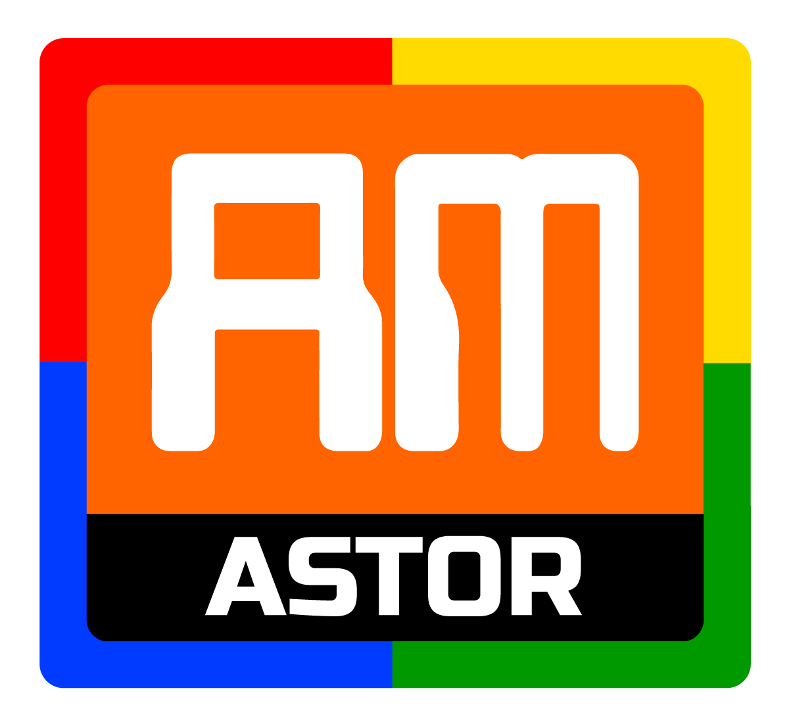
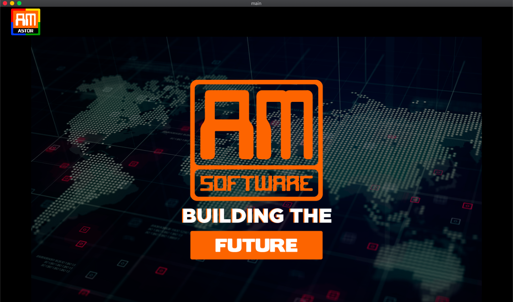
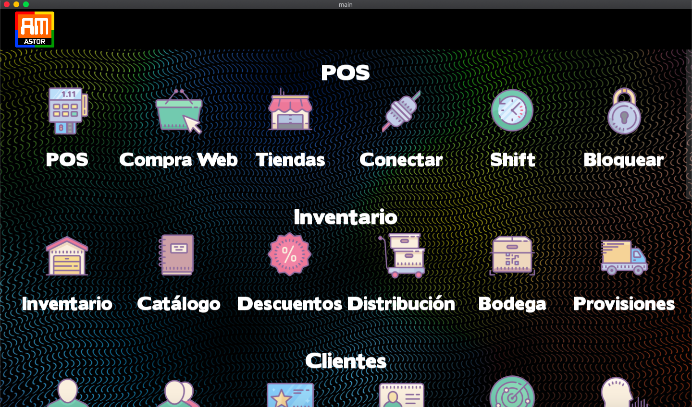
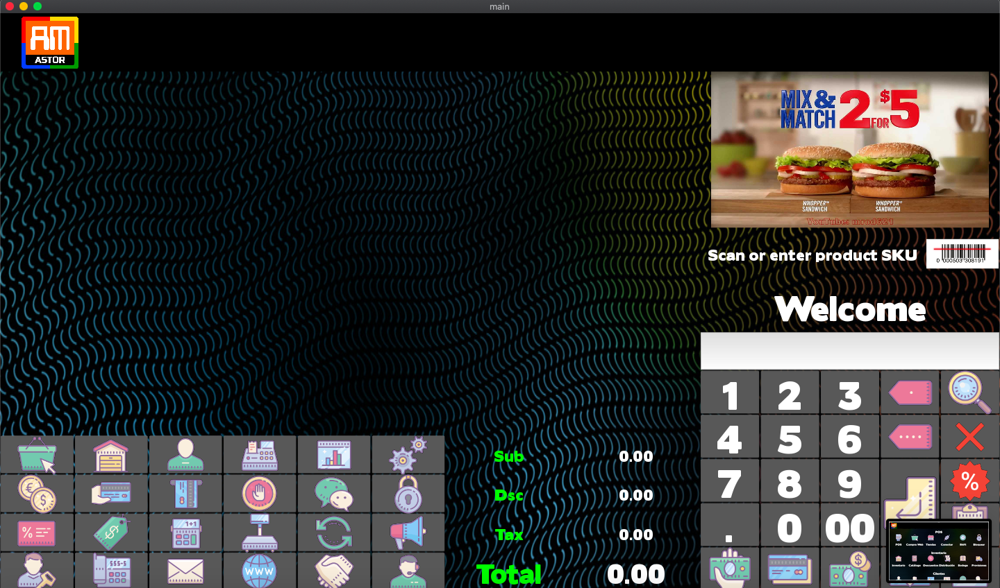
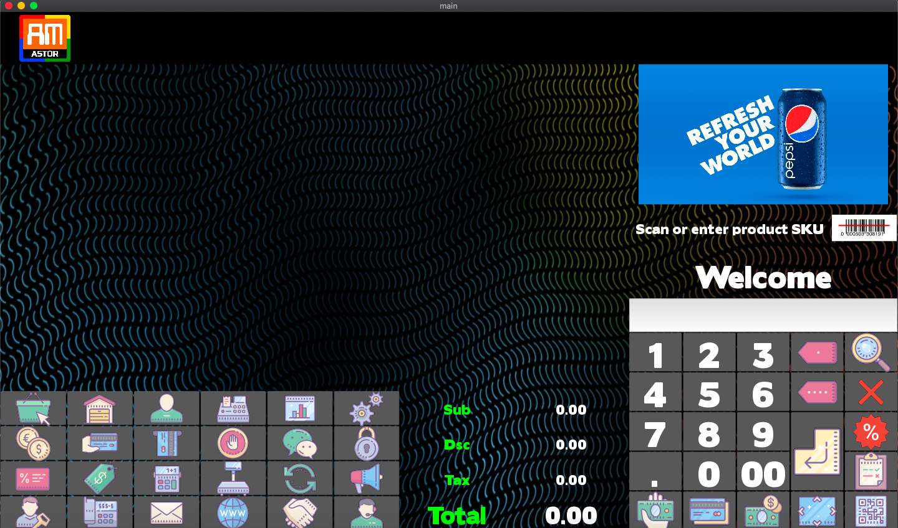
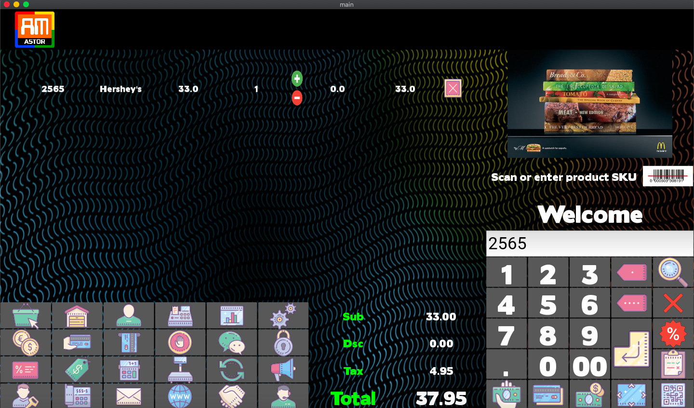

# AM Astor

## Overview

AM Astor is a modular Enterprise Application with ERP (Enterprise Resource Planning), CRM (Customer Relationship Management), HRM (Human Resource Management), IC (Inventory Control), SCM (Supply Chain Management), POS (Point-Of-Sale), POP (Point-Of-Purchase), BI (Business Intelligence) and E-Commerce capabilities, developed from scratch in Python.

The first version of AM Astor was developed as a multi-platform NUI (Natural User Interface) multitouch application for a variety of devices. It's compatible with the best digital barcode scanners and scales. A web version is currently under planning and design.

AM Astor is currently under testing.

Stay tuned for updates.

## History

The history of AM Astor dates way back from its development. I first developed a similar but far more basic project in Java back in 2012. Around 2016 I was contacted by a major retail chain to develop a modern and far more advanced version of their vastly outdated software, but the deal didn't come to fruition and I decided to keep developing a prototype for my own, and thus AM Astor was born.

## Screenshots

## Author

Written by Andrés Montenegro Argüello <<am@amsoftware.co>>, May 2016.

## License

Copyright © Andrés Montenegro Argüello <<am@amsoftware.co>>, AM Software <<http://www.amsoftware.co>> - All Rights Reserved.
Unauthorized copying of this software, via any medium is strictly prohibited.
Proprietary and confidential.
Written by Andrés Montenegro Argüello <<am@amsoftware.co>>, May 2016.
