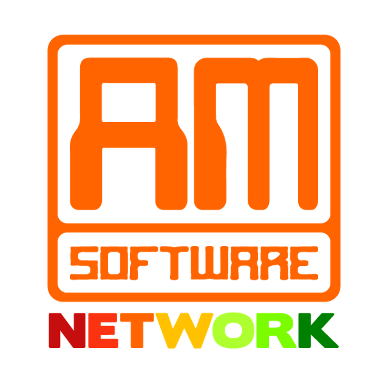

# AM Software Network

## Overview
AM Software Network is a project that’s been under development since 2018.

It is both a software project and a social project as well.

Stay tuned for updates.

## History
AM Software Network is a big independent project that started as an experiment in 2018 and developed into a mature AM Sofware project.

## Author
Written by Andrés Montenegro Argüello <<am@amsoftware.co>>, June 2018.

## License
Copyright © Andrés Montenegro Argüello <<am@amsoftware.co>>, AM Software <<http://www.amsoftware.co>> - All Rights Reserved.

Unauthorized copying of this software, via any medium is strictly prohibited.

Proprietary and confidential.

Written by Andrés Montenegro Argüello <<am@amsoftware.co>>, June 2018.