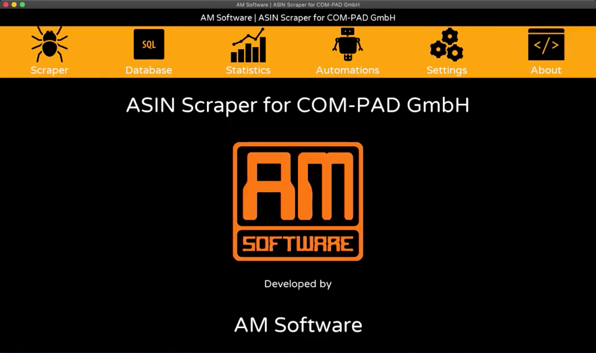
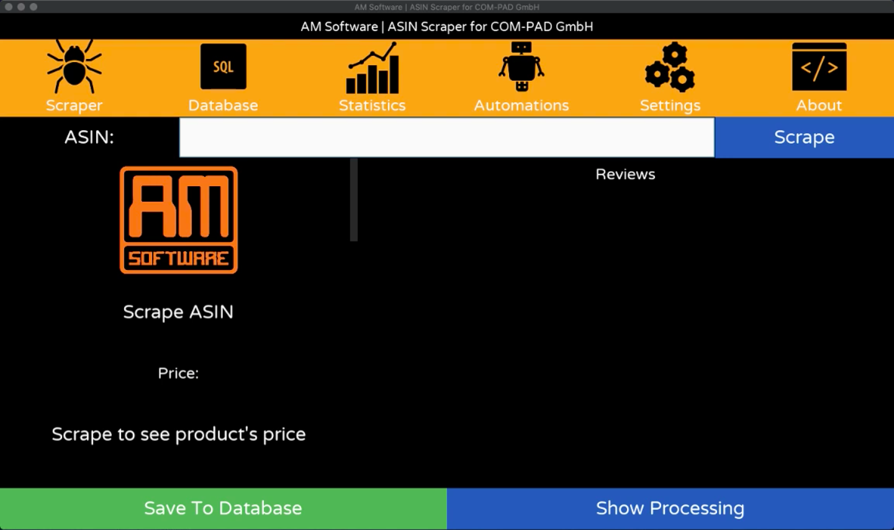
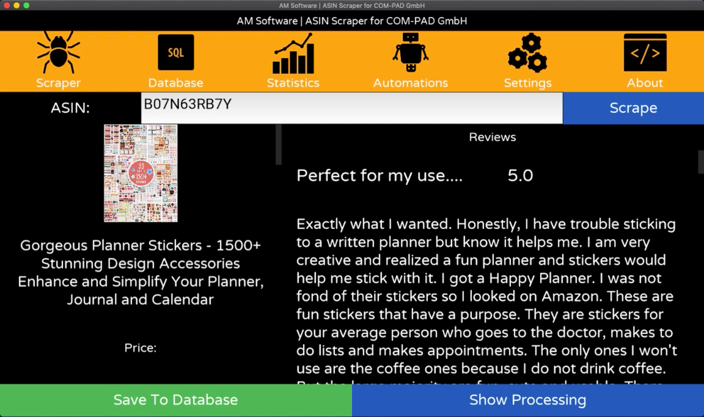
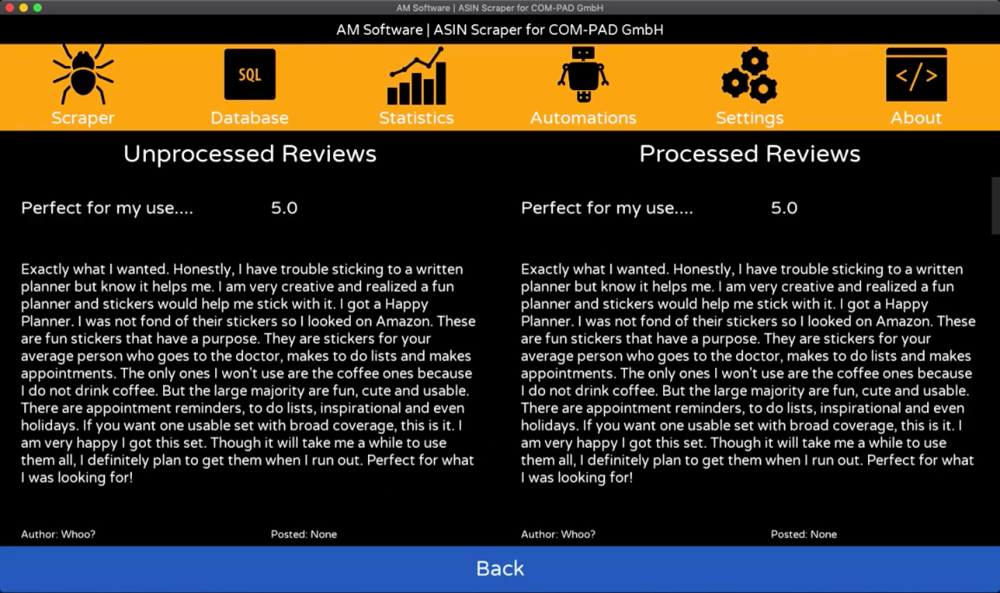

# ASIN Web Scraper NUI App

## Overview
This is the second iteration of the [ASIN Web Scraper](https://github.com/AndresMontenegroArguello/AM-Software/Projects/ASINWebScraper) that I developed from scratch and this includes a multi-platform NUI (Natural User Interface) multitouch application for a variety of devices, connected to a SQLite 3 Database Backend.

## Screenshots

## Demos

[ASIN Web Scraper Demo 1](https://www.youtube.com/watch?v=4jHiC19Iypg)

[ASIN Web Scraper Demo 2](https://www.youtube.com/watch?v=Spp_SukBm9I)

[ASIN Web Scraper Demo 3](https://www.youtube.com/watch?v=Spp_SukBm9I)

[ASIN Web Scraper Demo 4](https://www.youtube.com/watch?v=pvmBIWDycEU)

## Author
Written by Andrés Montenegro Argüello <<am@amsoftware.co>>, April 2020.

## License
Copyright © Andrés Montenegro Argüello <<am@amsoftware.co>>, AM Software <<http://www.amsoftware.co>> - All Rights Reserved.

Unauthorized copying of this software, via any medium is strictly prohibited.

Proprietary and confidential.

Written by Andrés Montenegro Argüello <<am@amsoftware.co>>, April 2020.