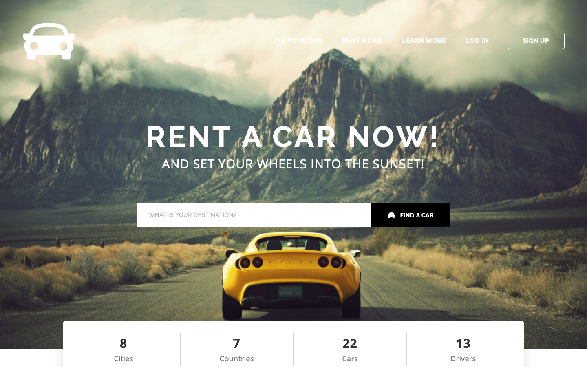
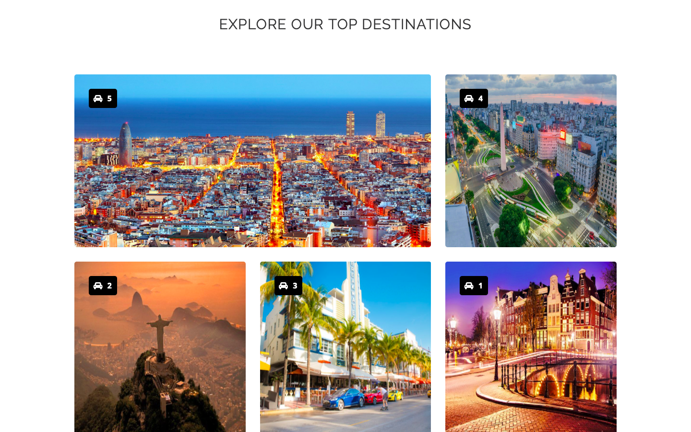
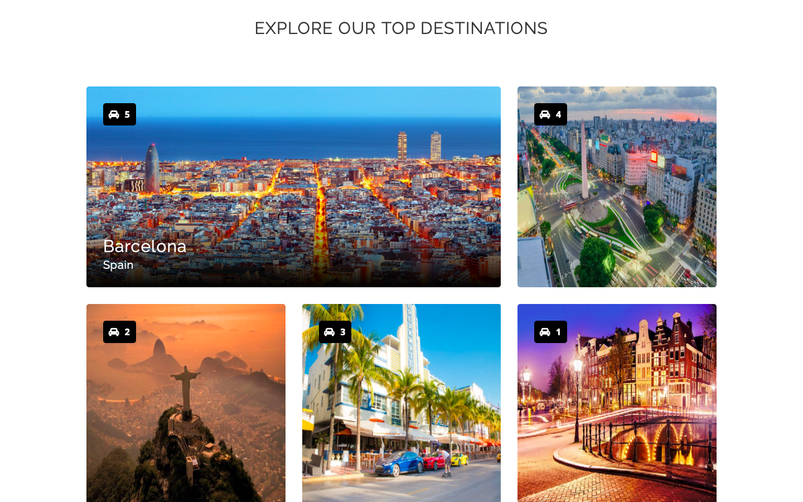
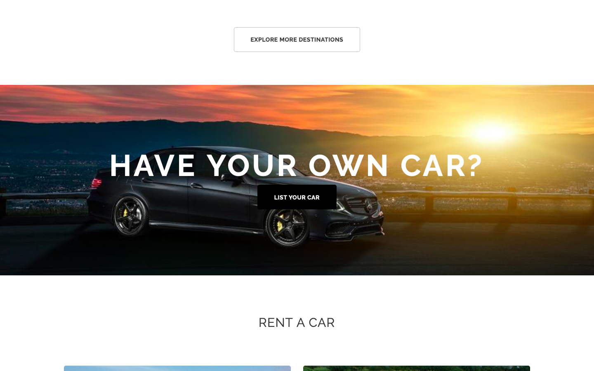
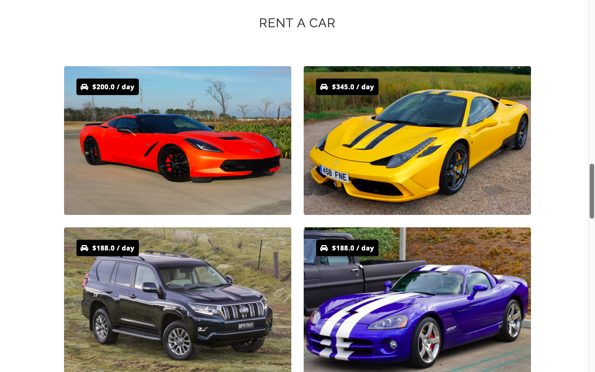
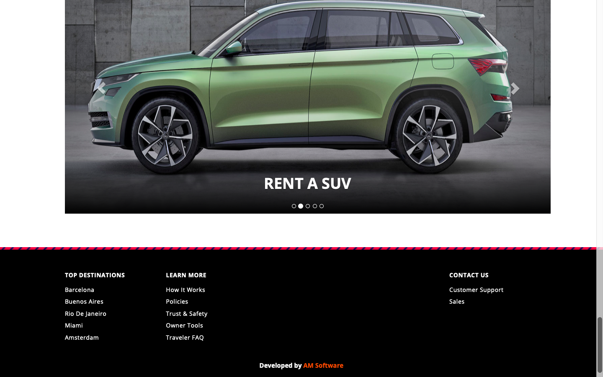
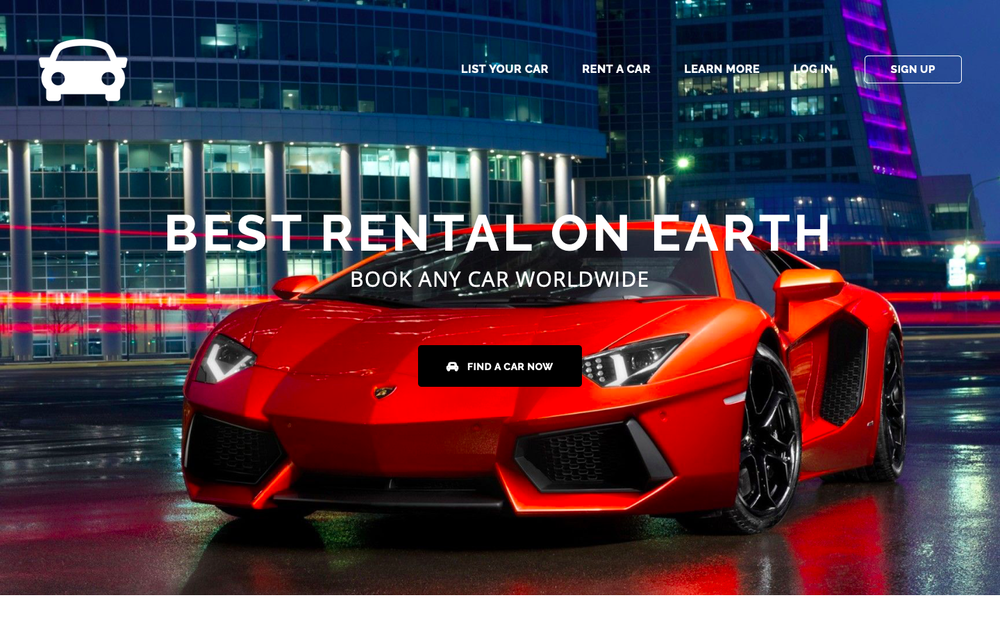
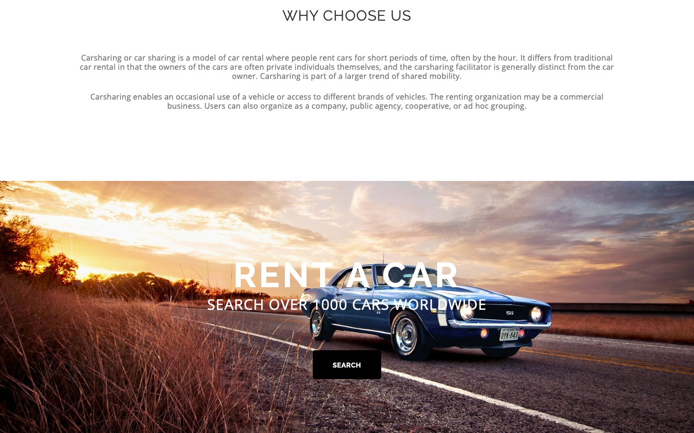
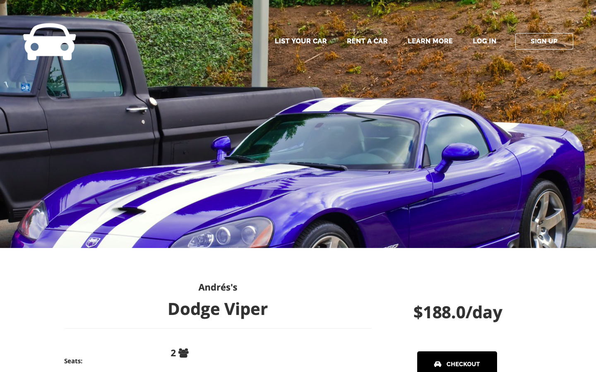
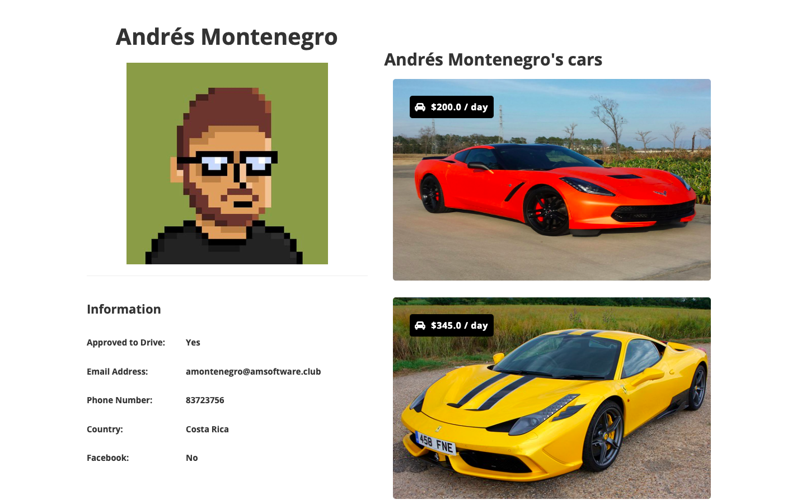

# Carsharing App

## Overview
This is a [Carsharing](https://en.wikipedia.org/wiki/Carsharing) App that I developed from scratch using Python 3 and Django with MySQL and SQLite Database Backends. It was initially developed for a real project which didn't come to fruition so I decided to keep it online as a [demo](https://carfreakclub.pythonanywhere.com) available to the public.

## Screenshots

## Demo

You can use the full [demo here](https://carfreakclub.pythonanywhere.com), and I also made some sample code from the application publicly available in the sample_code folder, for demonstration purposes.

## Author
Written by Andrés Montenegro Argüello <<am@amsoftware.co>>, June 2018.

## License
Copyright © Andrés Montenegro Argüello <<am@amsoftware.co>>, AM Software <<http://www.amsoftware.co>> - All Rights Reserved.

Unauthorized copying of this software, via any medium is strictly prohibited.

Proprietary and confidential.

Written by Andrés Montenegro Argüello <<am@amsoftware.co>>, June 2018.