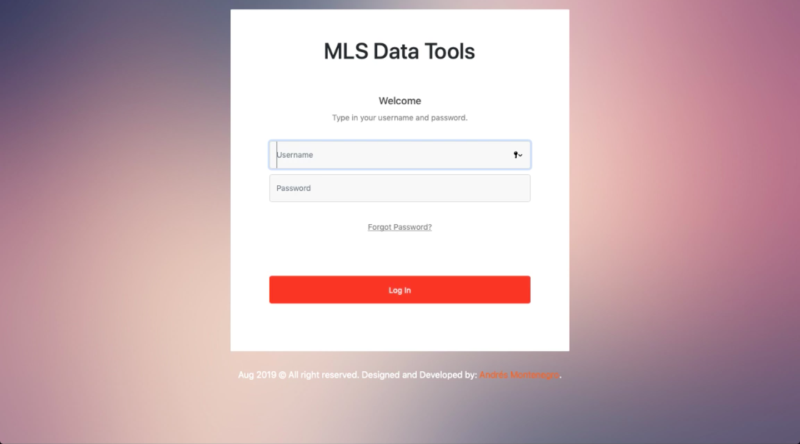

# MLS Data Tools MLS Charts Web Tool

## Overview
This is a web application I develop that connects to a server to retrieve millions of Real Estate property records, processes them and displays using many different modalities, including dynamic tables and graphical statistics dashboards with search features.

## Screenshots

## Demos

[Web Tool](https://www.youtube.com/watch?v=hpIKuNarrZw)

## Author
Written by Andrés Montenegro Argüello <<am@amsoftware.co>>, August 2019.

## License
Copyright © Andrés Montenegro Argüello <<am@amsoftware.co>>, AM Software <<http://www.amsoftware.co>> - All Rights Reserved.

Unauthorized copying of this software, via any medium is strictly prohibited.

Proprietary and confidential.

Written by Andrés Montenegro Argüello <<am@amsoftware.co>>, August 2019.