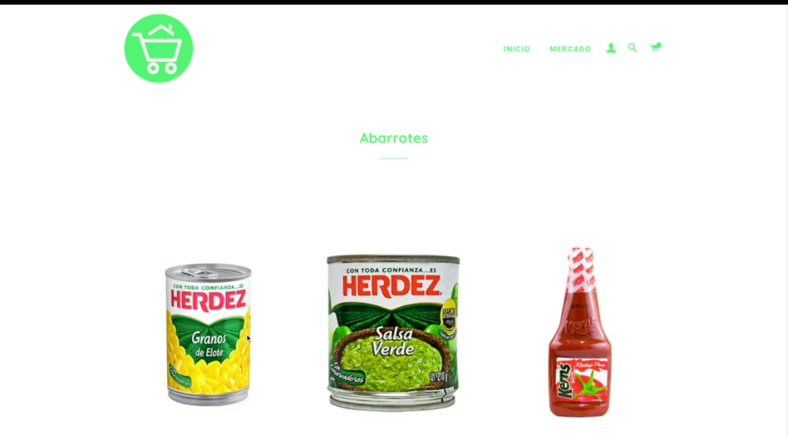

# Mercado En Casa

## Overview
This is a project I developed in 3 days for the [Starup Weekend](https://startupweekend.org) 2018 in Managua, Nicaragua, which earned the second winner spot in the competition.

It is an E-Commerce application for instant groceries delivery which I developed using various web technologies, but also validated as a profitable business model by a talented group of professionals in the fields of Finances, Marketing, Management, Design and Communication.

# History
This [article](https://niu.com.ni/del-miedo-al-exito-asi-me-converti-en-tres-dias-en-un-emprendedor/?fbclid=IwAR14dk0fntizxGGWCYuAiWctV41Uyi9Ab-TqQLxK92VsivF91LwCZoMdf64) details the history of this project,which I developed in 3 days for the [Starup Weekend](https://startupweekend.org) 2018 in Managua, Nicaragua, which earned the second winner spot in the competition.

# Screenshots

# Demo

## Author
Written by Andrés Montenegro Argüello <<am@amsoftware.co>>, November, 2018.

## License
Copyright © Andrés Montenegro Argüello <<am@amsoftware.co>>, AM Software <<http://www.amsoftware.co>> - All Rights Reserved.
Unauthorized copying of this software, via any medium is strictly prohibited.
Proprietary and confidential.
Written by Andrés Montenegro Argüello <<am@amsoftware.co>>, November, 2018.